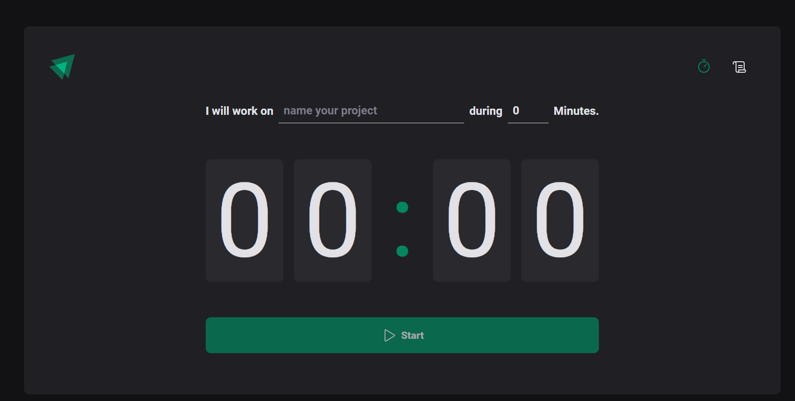
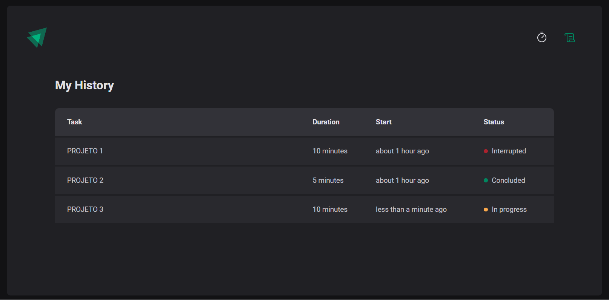

<div align='center'>
  
  
</div>

# Sobre o projeto 💬

O **Timer** é uma aplicação web desenvolvida na Rocketseat, utilizando o metodo 'Pomodoro'

## Funcionalidades 🧠

###  📕 A aplicação contém as seguintes funcionalidades:

- [x] Começar um ciclo.
- [x] Interromper um ciclo.
- [x] Visualizar um histórico sobre os ciclos.

## Pré-requisitos
#### Antes de começar, é bom ter instalado em sua maquina as seguintes ferramentas:
- [x] [GIT](https://git-scm.com/)
- [x] [VSCode](https://code.visualstudio.com/)
- [x] [NodeJs](https://nodejs.org/en/)

### Rodando o Projeto 📖

```bash
# Clone para este repositório
$ git clone https://github.com/Pedro-AugusCoelho/Timer.git

# Acesse a pasta do projeto no terminal/cmd
$ cd timer

# Instale as dependências
$ npm install/yarn

# Execute a aplicação em modo de desenvolvimento
$ npm run dev / yarn dev

# O servidor iniciará na porta:5173 - acesse <http://127.0.0.1:5173>
```

## Tecnologias 🛠

Desenvolvido utilizando as seguintes tecnologias:

- [REACT.JS](https://reactjs.org/)
- [VITE](https://vitejs.dev/)
- [TYPESCRIPT](https://www.typescriptlang.org/)
- [STYLED-COMPONENTS](https://styled-components.com/)
- [REACT-ROUTER-DOM](https://www.npmjs.com/package/react-router-dom)
- [REACT-HOOK-FORM](https://www.react-hook-form.com/)
- [UUID](https://www.npmjs.com/package/uuid)
- [PHOSPHOR](https://phosphoricons.com/)
- [IMMER](https://immerjs.github.io/immer/)
- [DATE-FNS](https://date-fns.org/)
- [ESLINT](https://eslint.org/)

## Desenvolvido ##

- [Rocketseat](https://www.rocketseat.com.br/index)

****************

<p align="center">Feito por: Pedro Augusto & Rocketseat</p>
